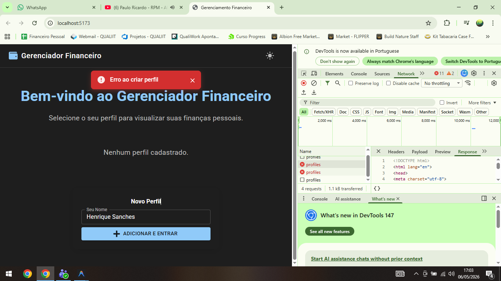

# Gerenciador Financeiro Simples

Bem-vindo ao **Gerenciador Financeiro Simples**! Este é um aplicativo básico de gerenciamento financeiro, criado para fins de aprendizado e uso pessoal. Ele permite que você gerencie suas finanças de forma simples, organizadas por perfis individuais.

---

## 🚀 Funcionalidades

- **Gerenciamento de Perfis**:
  - Seleção simples de perfil na tela inicial (sem necessidade de senhas complexas).
  - Criação rápida de novos perfis com apenas o nome.
  - Dados isolados para cada perfil.
  
- **Gerenciamento Financeiro**:
  - Adicionar, editar e excluir transações financeiras.
  - Visualizar uma lista de transações.
  - Resumo simples de receitas e despesas.

- **Tecnologias Utilizadas**:
  - **Frontend**: React.js + Vite
  - **Backend**: Node.js + Express
  - **Banco de Dados**: SQLite

---

## 📂 Estrutura do Projeto

### **Está detalhadamente explicado na pasta "Documentações"**

---

## 🔧 Instalação e Execução

### Pré-requisitos
- Node.js (versão 14 ou superior)
- npm ou yarn

### Backend
1. Navegue até a pasta do backend:
   ```
   cd backend
   ```

2. Instale as dependências:
   ```
   npm install
   ```

3. Configure as variáveis de ambiente:
   - Crie um arquivo `.env` na raiz do backend (use o arquivo `.env.example` como referência)

4. Inicialize o servidor:
   ```
   npm run dev
   ```
   O servidor estará rodando em `http://localhost:3000`

### Frontend
1. Navegue até a pasta do frontend:
   ```
   cd frontend
   ```

2. Instale as dependências:
   ```
   npm install
   ```

3. Inicie a aplicação:
   ```
   npm run dev
   ```
   A aplicação estará rodando em `http://localhost:5173`

---

## 📚 Documentação

O código está completamente documentado (pasta Documentações) para facilitar o entendimento e aprendizado:

- **Backend**: Os controladores, modelos e rotas contêm comentários explicando sua funcionalidade.
- **Frontend**: Os componentes principais e serviços estão documentados para entendimento do fluxo.

Para entender melhor a estrutura do projeto:
1. Comece examinando o `server.js` no backend
2. Veja como as rotas são organizadas em `routes/`
3. No frontend, o `App.jsx` fornece uma visão geral da aplicação

---

## 🎓 Uso Educacional

Este projeto foi desenvolvido com finalidade educacional e está disponível para:

- Estudo de arquitetura de aplicações web full-stack
- Implementação de banco de dados e APIs REST
- Implementação de CRUD básico
- Exemplo de integração React com Node.js e gerenciamento de estado simples

Sinta-se livre para clonar, modificar e usar como base para seus próprios projetos de aprendizado!

---

## 👨‍💻 Autor

**Henrique Sanches**

- Projeto desenvolvido para fins de aprendizado e portfólio
- Contato: sanches.hdigital@gmail.com

---

## 📝 Licença

Este projeto é de código aberto e está disponível para fins educacionais.

---

## 🙏 Agradecimentos

- Agradeço a todos que contribuíram com ideias e sugestões para este projeto educacional.
- Feito com 💙, café e JavaScript.

